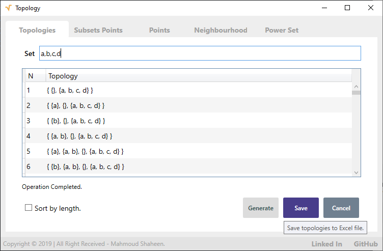
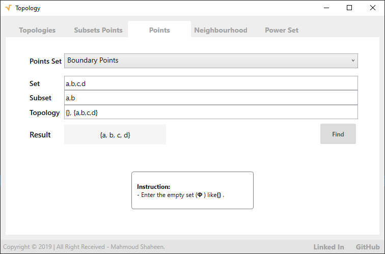
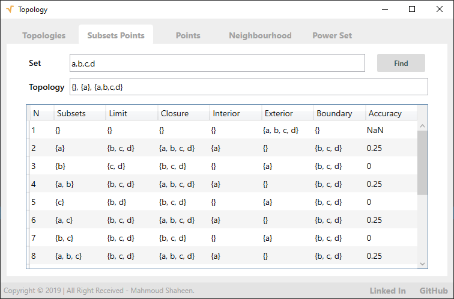
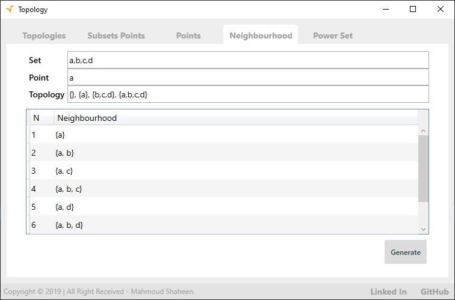
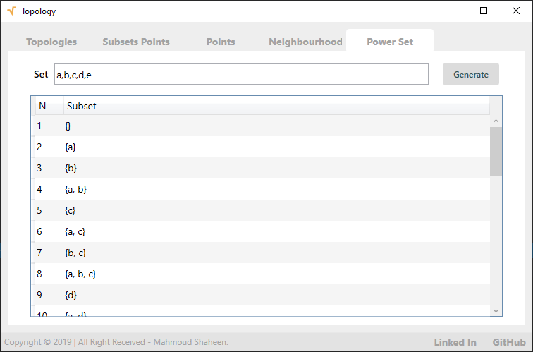

# Topology Toolkit

This provides a tool to solve some topological problems like find powerset, topologies defined on a given set, limit points, closure points, interior points, exterior points, and boundary points. Still working on it to use these tools to provide a tool that can analyze topological problems.

## Project structure

- `Core` is a cross-platform library
- `CLI` is cross-platform CLI
- `GUI` is Windows OS user interface using WPF Framework.

## Screens

