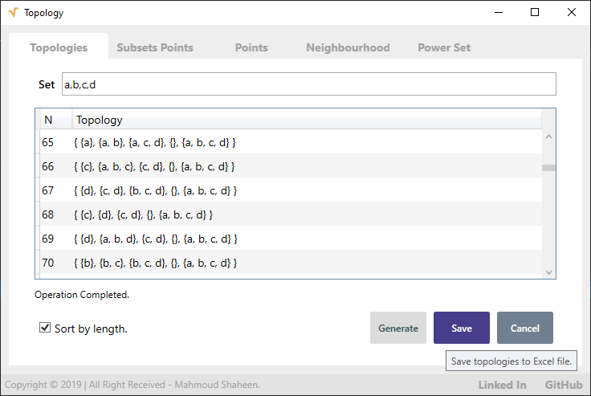

# Topology
 Find powerset, topologies defined on a given set, limit points, closure points, interior points, exterior points, and boundary points.

- `Model` Enums and models.
- `Infra` cross-platform topology library
- `CLI` is cross-platform CLI
- `GUI` is Windows OS user interface using WPF Framework.

